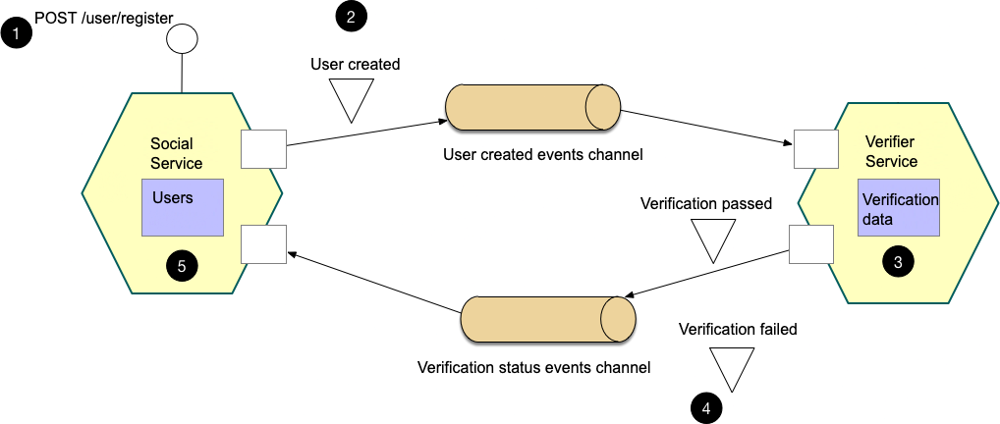
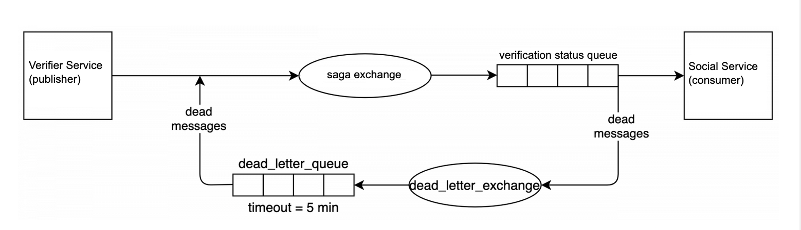

# Паттерн сага

## Задание

Разработайте и внедрите функционал, в котором будет необходимость применения паттерна Saga

## Реализация

В рамках данного ДЗ реализован следующий функционал, в котором применяется паттерн Saga:

1 - Сервис соц.сети `Social Service` получает запрос на регистрацию пользователя `POST /user/register` и создаёт у себя в БД пользователя со статусом `UserPendingVerification` (соответствует значению 0 в поле `user_status`).  
2 - Сервис соц.сети `Social Service` отправляет в очередь событие `User created`.  
3 - Сервис `Verifier Service` получает событие `User created`. Предполагается, что сервис выполняет верификацию данных пользователя и сохраняет у себя в БД статус. В данном ДЗ этот функционал не реализован - вместо него статус верификации генерируется случайным образом.  
4 - Сервис `Verifier Service` отправляет в очередь события `Verification passed` или `Verification failed`.  
5 - Сервис соц.сети `Social Service` получает события о статусе верификации и в соответствии с ним обновляет в БД статус пользователя на `UserVerificationFailed` (значение 10) или `UserVerificationSucceeded` (значение 100). Обновление статуса идемпотентно, т.к. значения статуса упорядочены по значимости, и в запросе есть соответствующая проверка.  
В саге поддерживается трассировка запросов (все соответствующие данные передаются по очередям).  

В качестве дальнейшей доработки потребуется добавить очередь ретраев.  
Например, рассмотрим вариант добавления такой очереди для обновления статуса пользователя на этапе 5.  

  

Для этого нужно:
- Настроить `dead_letter_exchange` и `dead_letter_queue` у очереди `verification status queue`.
- Сделать `dead_letter_queue` очередью с таймаутом. Для этого задать параметр `x-message-ttl`, определяющий, сколько миллисекунд сообщение просуществует в очереди, прежде чем будет помечено "мёртвым" и перейдёт в DLE.
- Для `dead_letter_queue` в качестве dead letter exchange указать `saga exchange`. Таким образом, получится петля. Мы зацикливаем путь сообщения, отправляя его после таймаута из `dead_letter_queue` снова в исходный exchange.

Таким образом:
- `Verifier Service` публикует статус верификации в `saga exchange`.
- Сообщение попадает в очередь `verification status queue`.
- `Social Service` не может обработать статус, вызывает метод `Nack` у `rabbitmq`.
- Сообщение попадает в `dead_letter_exchange`.
- Оттуда сразу в `dead_letter_queue`.
- В этой очереди сообщение проводит `x-message-ttl`, потом будет помечено "мёртвым".
- "Мёртвое" сообщение попадает в dead letter exchange очереди `dead_letter_queue`, а это `saga exchange`.

## Запуск приложения

В [Makefile](../Makefile):
- `make up-memory` - поднять окружение (БД Postgres master, tarantool, кеши, очередь), автоматически применить миграции, поднять сервис
- `make down-memory` - потушить окружение и сервис

