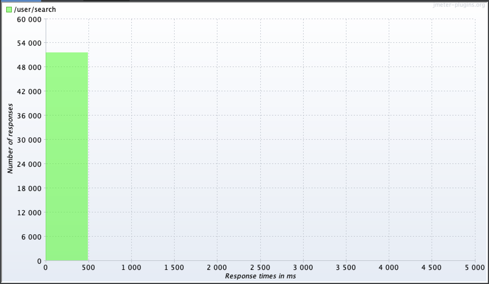

# Оптимизация поиска с помощью индексов в Postgres

## Запрос для поиска анкет по префиксу имени и фамилии (одновременно)
```sql
SELECT id, first_name, second_name, city, gender, birthdate, biography
FROM users
WHERE first_name LIKE :first_name AND second_name LIKE :last_name
ORDER BY id
```

## Получение плана запроса
```sql
explain analyze SELECT id, first_name, second_name, city, gender, birthdate, biography
FROM users
WHERE first_name LIKE 'Конст%' AND second_name LIKE 'Абрам%'
ORDER BY id
```

## Загрузка данных в таблицу для НТ
Предварительно было создано расширение `uuid-ossp` с помощью [uuid_extension.sql](../backend/migrator/migrations/20241202135709_uuid_extension.sql).  
Затем в таблицу `users` был загружен готовый файл [people.v2.csv](https://raw.githubusercontent.com/OtusTeam/highload/master/homework/people.v2.csv) с помощью скрипта [load_data.sh](load_data.sh).

## Нагрузочное тестирование
НТ проводилось с помощью JMeter.  
План НТ - [index_load_test.jmx](index_load_test.jmx)  
Общее описание плана:
- в начале теста необходимо зарегистрировать нового пользователя и получить токен для последующего выполнения запроса `/user/search`. Поэтому для регистрации (`/user/register`) и получения токена (`/login`) использована `setUp` группа потоков с 1 потоком.
- само НТ метода `/user/search` выполняется в другой группе потоков с настраиваемым количеством потоков. В данном запросе используется токен, полученный на шаге `setUp`. Параметры метода `first_name` и `last_name` генерируются случайным образом и состоят из 3-х символов русского алфавита с первой заглавной буквой:
```
first_name=${__changeCase(${__RandomString(3,абвгдеёжзийклмнопрстуфхцчшщъыьэюя,firstName)},CAPITALIZE,)}
last_name=${__changeCase(${__RandomString(3,абвгдеёжзийклмнопрстуфхцчшщъыьэюя,lastName)},CAPITALIZE,)}
```
Количество потоков - 1/10/100/1000, скорость "разгона" - 1s/1s/10s/30s соответственно, продолжительность - 60s, таймаут на соединение - 1s, таймаут на получение ответа - 5s.

## Без индекса
### План запроса без индекса
```
Sort  (cost=24051.95..24051.95 rows=1 width=128) (actual time=263.424..264.927 rows=28 loops=1)
  Sort Key: id
  Sort Method: quicksort  Memory: 28kB
  ->  Gather  (cost=1000.00..24051.94 rows=1 width=128) (actual time=5.866..264.614 rows=28 loops=1)
        Workers Planned: 2
        Workers Launched: 2
        ->  Parallel Seq Scan on users  (cost=0.00..23051.84 rows=1 width=128) (actual time=168.156..253.868 rows=9 loops=3)
              Filter: (((first_name)::text ~~ 'Конст%'::text) AND ((second_name)::text ~~ 'Абрам%'::text))
              Rows Removed by Filter: 333316
Planning Time: 6.814 ms
Execution Time: 266.118 ms
```

Используется Parallel Seq Scan, т.е. полный перебор записей таблицы.

### Результаты НТ
Для запроса без индекса были проведены НТ только с количеством потоков 1/10/100, т.к. при 100 потоков более 95% запросов не проходили таймаут в 5 секунд, и увеличение количества потоков не имело смысла.

|   # Threads  |   # Samples  |   Average  |   Median  |   90% Line  |   95% Line  |   99% Line  |   Min  |   Max  |   Error %  |   Throughput  |   Received KB/sec  |   Sent KB/sec  |
|---|---|---|---|---|---|---|---|---|---|---|---|---|
| 1 |   713  |   83  |   93  |   98  |   100  |   104  |   25  |   204  |   0.000%  |   11.87918  |   1.44  |   6.50  |
| 10 |   664  |   900  |   788  |   1490  |   1579  |   1705  |   295  |   1899  |   0.000%  |   10.97357  |   1.33  |   6.00  |
| 100 |   1234  |   4658  |   5001  |   5002  |   5002  |   5003  |   285  |   5018  |   96.029%  |   19.25658  |   46.04  |   1.08  |

#### Графики для 1 потока (без индекса)
|  |  |  |  |
|-----------------------|-----------------------|-----------------------|-----------------------|

#### Графики для 10 потоков (без индекса)
|  |  |  |  |
|-----------------------|-----------------------|-----------------------|-----------------------|

#### Графики для 100 потоков (без индекса)
|  |  |  |  |
|-----------------------|-----------------------|-----------------------|-----------------------|

## С составным индексом по first_name и second_name
### Запрос построения индекса
```sql
create index first_name_second_name_idx on users(first_name text_pattern_ops, second_name text_pattern_ops);
```
(см. [users_name_index.sql](../backend/migrator/migrations/20241203090000_users_name_index.sql))

Для запроса в форме `first_name LIKE 'prefix%' and second_name LIKE 'prefix%'` такой индекс выглядит наиболее оптимальным, т.к. поля индекса полностью соответствуют условиям фильтрации (поиск сначала по first_name, затем - по second_name). Параметр text_pattern_ops используется для того, чтобы можно было искать по условию LIKE 'prefix%'. По умолчанию строится индекс btree.

### План запроса с индексом
```
Sort  (cost=347.73..347.74 rows=1 width=128) (actual time=0.804..0.806 rows=28 loops=1)
  Sort Key: id
  Sort Method: quicksort  Memory: 28kB
  ->  Bitmap Heap Scan on users  (cost=158.93..347.72 rows=1 width=128) (actual time=0.447..0.715 rows=28 loops=1)
        Filter: (((first_name)::text ~~ 'Конст%'::text) AND ((second_name)::text ~~ 'Абрам%'::text))
        Heap Blocks: exact=19
        ->  Bitmap Index Scan on first_name_second_name_idx  (cost=0.00..158.93 rows=49 width=0) (actual time=0.369..0.369 rows=28 loops=1)
              Index Cond: (((first_name)::text ~>=~ 'Конст'::text) AND ((first_name)::text ~<~ 'Консу'::text) AND ((second_name)::text ~>=~ 'Абрам'::text) AND ((second_name)::text ~<~ 'Абран'::text))
Planning Time: 1.108 ms
Execution Time: 1.107 ms
```
Используется Bitmap Index Scan для фильтрации значений, затем Bitmap Heap Scan для получения остальных полей таблицы для отобранных записей, финально - сортировка по id методом quicksort. Cost существенно ниже по сравнению с планом без индекса.

### Результаты НТ
Для запроса с составным индексом были проведены НТ с количеством потоков 1/10/100/1000. Для 1000 потоков видно, что всё упирается в пропускную способность БД (как минимум - в максимальное количество соединений, которое по умолчанию равно 100 `SHOW max_connections`).  15% запросов завершаются ошибкой таймаута в 5 секунд.  
Также сам запрос выглядит недостаточно оптимальным - поиск производится сначала по имени, а потом по фамилии, хотя фамилия более уникальна.  
При этом, по сравнению с запросом без индекса, производительность существенно увеличилась.  
Например, для 100 потоков:
- среднее время ответа с индексом - 149ms, без индекса - 4658ms
- 90 персентиль с индексом - 574ms, без индекса - 5002ms
- пропускная способность с индексом - 608, без индекса - 19
- количество ошибок с индексом - 0%, без индекса - 96%

| # Threads |   # Samples  |   Average  |   Median  |   90% Line  |   95% Line  |   99% Line  |   Min  |   Max  |   Error %  |   Throughput  |   Received KB/sec  |   Sent KB/sec  |
|---|---|---|---|---|---|---|---|---|---|---|---|---|
| 1 |   161991  |   0  |   0  |   1  |   1  |   1  |   0  |   12  |   0.000%  |   2699.94000  |   326.95  |   1476.53  |
| 10 |   51837  |   11  |   2  |   57  |   76  |   88  |   0  |   203  |   0.000%  |   863.77724  |   104.64  |   472.38  |
| 100 |   36804  |   149  |   5  |   574  |   604  |   1064  |   0  |   1504  |   0.000%  |   608.93448  |   73.74  |   333.01  |
| 1000 |   38869  |   1201  |   12  |   5001  |   5002  |   5003  |   0  |   5102  |   14.914%  |   608.10726  |   299.96  |   282.96  |

#### Графики для 1 потока (с индексом)
|  |  |  |  |
|-----------------------|-----------------------|-----------------------|-----------------------|

#### Графики для 10 потоков (с индексом)
|  |  |  |  |
|-----------------------|-----------------------|-----------------------|-----------------------|

#### Графики для 100 потоков (с индексом)
|  |  |  |  |
|-----------------------|-----------------------|-----------------------|-----------------------|

#### Графики для 1000 потоков (с индексом)
|  |  |  |  |
|-----------------------|-----------------------|-----------------------|-----------------------|