# Применение In-Memory СУБД

## Задание

Необходимо перенести хранение одного из модулей приложения ("диалоги") в In-Memory СУБД с поддержкой функциональности application server (возможность выполнять UDF над данными) - Tarantool, Redis, Apache Ignite, Hazelcast, …

Требования:
- Выбрать один из модулей приложения: например диалоги
- Провести нагрузочное тестирование этого модуля для дальнейшего сравнения
- Вынести хранение данных из SQL БД в In-Memory СУБД. Перенести логику из модуля в UDF в In-Memory СУБД. Например: для общения с tarantool'ом использовать процедуры (функции lua), не использовать прямые запросы в space'ы при помощи драйвера.
- Провести нагрузочное тестирование снова
- Сравнить результаты нагрузочного тестирования

## Реализация

### Настройки In-Memory СУБД
В качестве In-Memory СУБД выбрана СУБД Tarantool. 
Файл docker-compose для Tarantool - [docker-compose-tarantool.yaml](../deployments/docker-compose-tarantool.yaml).  
При старте применяются миграции схемы, задаются настройки, создаются пользовательские таблицы (space), функции, индексы. В Tarantool нет инструментов для применения миграций (аналогичных `goose` для Postgres, например). Поэтому, чтобы не было конфликтов при применении схемы, используется вручную реализованный `migration_lock`. Файлы с настройками и миграциями - [schema.lua](../backend/tarantool/schema.lua), [001_create_messages_space.lua](../backend/tarantool/migrations/001_create_messages_space.lua).  
Используемые настройки, где TARANTOOL_MEMTX_MEMORY == 512Мб (это уже финальные настройки, выставленные в результате НТ):
```
box.cfg{
    listen = 3301,
    memtx_memory = tonumber(os.getenv('TARANTOOL_MEMTX_MEMORY')) or 268435456,
    log_level = 6,
    net_msg_max = 4096,
    readahead = 131072,
    iproto_threads = 8,
    too_long_threshold = 1,
    worker_pool_threads = 8,
    memtx_max_tuple_size = 1048576,
    slab_alloc_factor = 1.1
}
```
Таблица `messages` в целом повторяет структуру аналогичной таблицы в Postgres. Также создан уникальный TREE-индекс по полям `dialog_id` и `message_id` (в ходе НТ проверялся и индекс только по полю `dialog_id` - на производительность это не повлияло):
```
box.space.messages:create_index('primary', {
    parts = {'dialog_id', 'message_id'}, 
    unique = true,
    type = "TREE"
})
```
Созданы функции:
- `insert_message` - для вставки сообщения
- `batch_insert_messages` - для вставки сообщений пачками (при генерации данных)
- `get_messages_by_dialog` - для выборки по ID диалога. В данной функции опущена сортировка по убыванию sendTime, т.к. даже с такой реализацией Tarantool показывает не очень хорошие результаты (будет показано дальше).  

В коде при подключении к Tarantool установлен Concurrency == 512.  

Параметр, определяющий то, какая СУБД будет использоваться, вынесен в конфиг - `dialogue.dbType`. Его возможные значения - SQL (используется Postgres), MEMORY (используется Tarantool).

### Генерация данных

Поднята инфраструктура через [Makefile](../Makefile):
- `make up-infra` - поднять окружение (БД Postgres master, tarantool, кеши, очередь)
- `make down-infra` - потушить окружение

Использован скрипт для генерации данных по диалогам в Postgres и Tarantool - [dialog-generator](../backend/cmd/dialog-generator/main.go). Из таблицы `users` (которая заполнена в предыдущих ДЗ) в цикле случайным образом отбирается по 2 пользователя, рассчитывается `dialog_id` (аналогично коду приложения, с использованием `murmur3.Sum128`), генерируются сообщения. Всего сгенерировано 10_000 диалогов, в каждом - по 100 сообщений (по 50 сообщений от каждого пользователя). Данные записаны в Postgres, Tarantool, а также в csv файл, чтобы впоследствии использовать в Jmeter при НТ.  

После генерации в Tarantool вызван `box.snapshot()`, чтобы инициировать ручное сохранение данных. Для этого выполнено подключение к контейнеру Tarantool, а внутри него - `tarantoolctl connect localhost:3301`. Через `tarantoolctl` также можно проверить работоспособность функции `get_messages_by_dialog('6391bf6d37bb69d849f2fff6e1c201e1')`, посмотреть количество записей в таблице `box.space.messages:count()` и т.д.

###  Нагрузочное тестирование
НТ проводилось с помощью JMeter.  
План НТ - [inmemory.jmx](inmemory.jmx)  
Общее описание плана:
- В начале теста необходимо загрузить данные по пользователям, для которых будут выполняться запросы GET `/dialog/:user_id/list`. Для этого используется `setUp` группа потоков с 1 потоком, в которой в JSR223 Sampler с помощью кода на groovy загружаются в properties данные из сгененированного ранее файла (`userId1`, `userId2`, `dialogId`).
- Само НТ метода `/dialog/:user_id/list` состоит из нескольких шагов:
    - выбрать случайную пару `userId1`-`userId2` из файла
    - получить токен (`/login`) для пользователя `userId1`
    - вызвать метод GET `/dialog/:user_id/list` с полученным токеном и параметром `:user_id` равным `userId2`

Количество потоков - 100/1000, скорость "разгона" - 30s, продолжительность - 60s, таймаут на соединение - 1s, таймаут на получение ответа - 5s.

### Результаты НТ Postgres

Для проведения НТ с Postgres сервис был поднят с параметром `dialogue.dbType`=`SQL` в [конфигах](../backend/configs/server_config.yaml) через `make up-memory` в [Makefile](../Makefile).  
По результатам видно, что в целом Postgres справляется и с высокой нагрузкой, даже при 1000 потоках сервис отвечает в течение 5 секунд, ошибочных запросов нет. При этом, в запросе Postgres присутствует сортировка по времени отправки сообщения (`send_time`).

| # Threads |   # Samples  |   Average  |   Median  |   90% Line  |   95% Line  |   99% Line  |   Min  |   Max  |   Error %  |   Throughput  |   Received KB/sec  |   Sent KB/sec  |
|---|---|---|---|---|---|---|---|---|---|---|---|---|
| 100 |   8367  |   124  |   124  |   219  |   249  |   319  |   1  |   728  |   0.000%  |   139.18555  |   2125.43  |   73.13  |
| 1000 |   8158  |   2428  |   2955  |   3467  |   3588  |   3802  |   1  |   4232  |   0.000%  |   129.24998  |   1973.71  |   67.91  |

#### Графики для 100 потоков (Postgres)
| 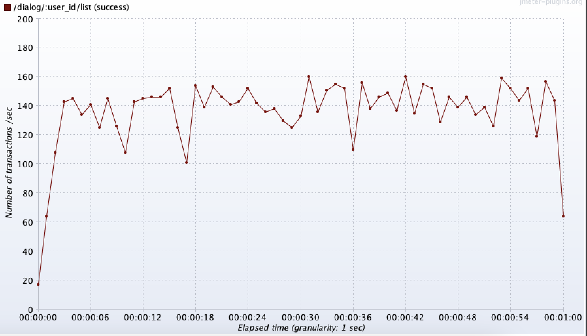 | 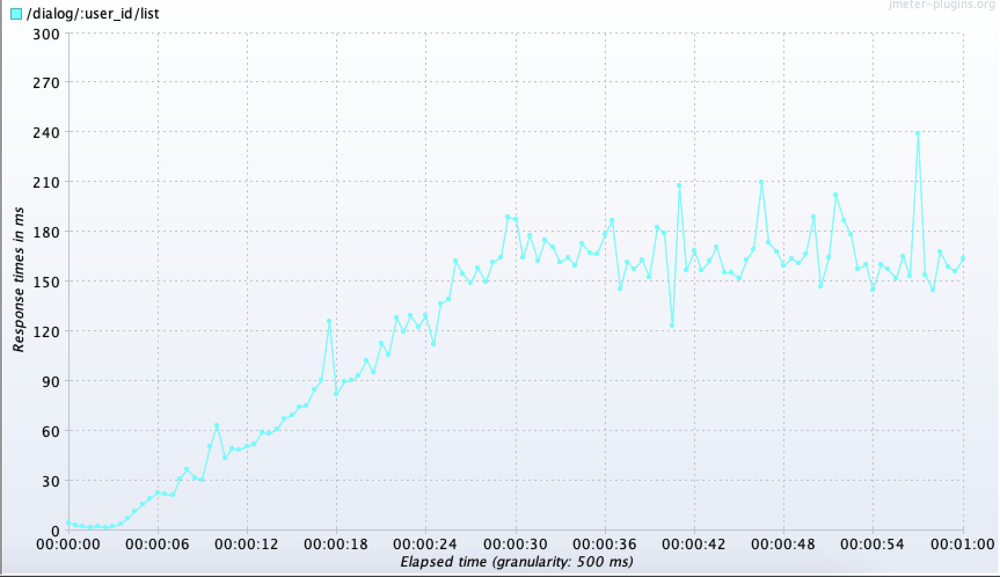 | 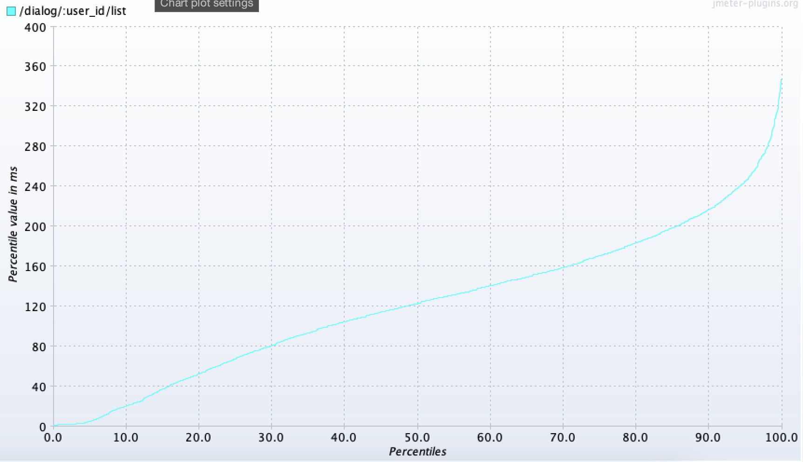 | 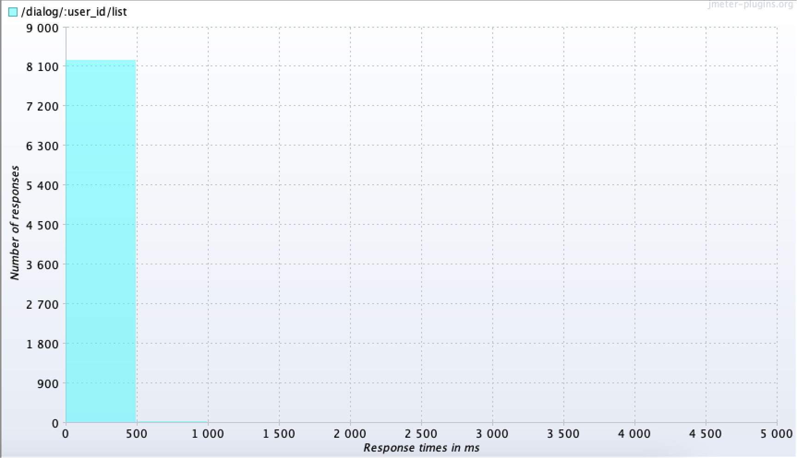 |
|-----------------------|-----------------------|-----------------------|-----------------------|

#### Графики для 1000 потоков (Postgres)
| 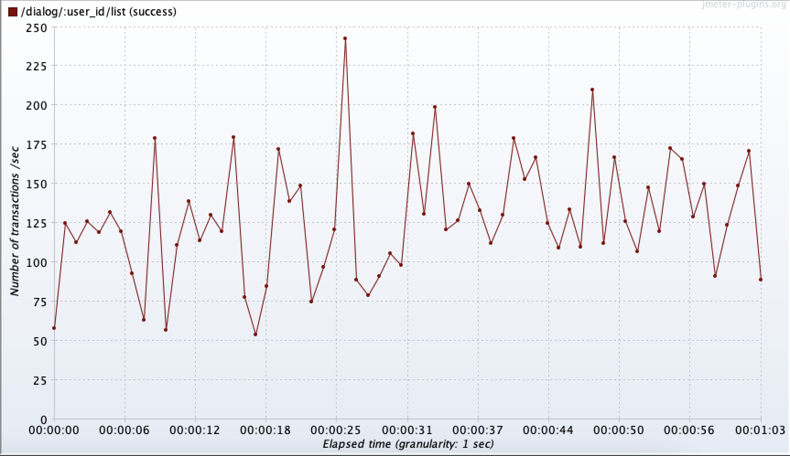 | 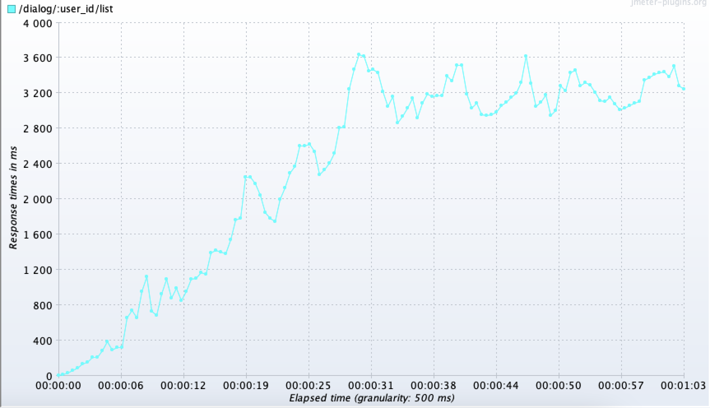 | 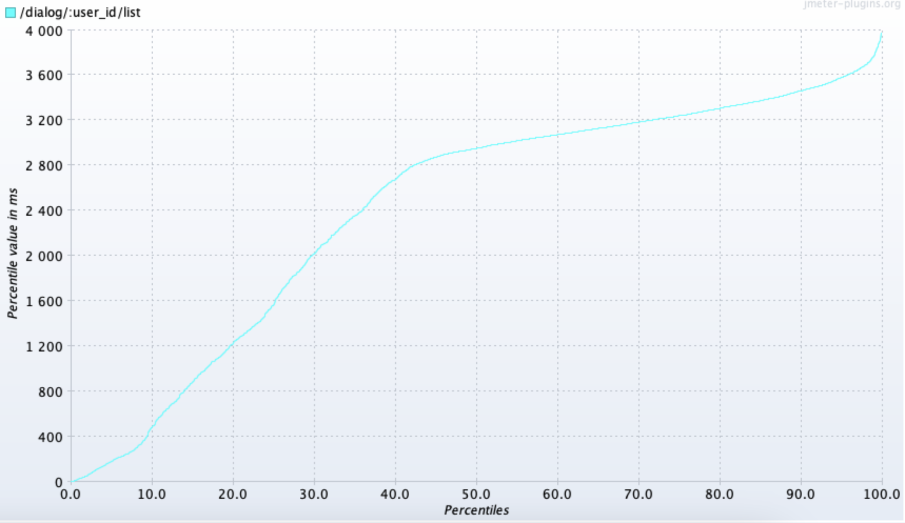 | 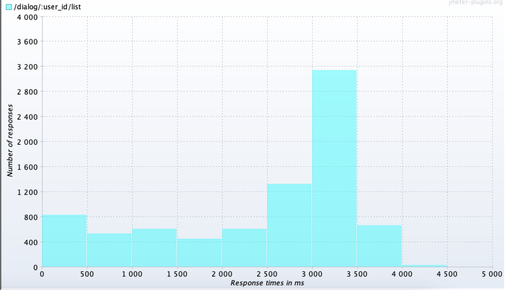 |
|-----------------------|-----------------------|-----------------------|-----------------------|

### Результаты НТ Tarantool

Для проведения НТ с Tarantool сервис был поднят с параметром `dialogue.dbType`=`MEMORY` в [конфигах](../backend/configs/server_config.yaml) через `make up-memory` в [Makefile](../Makefile).  
По результатам видно, что Tarantool намного хуже справляется с нагрузкой (даже с учётом того, что просто идёт выборка по ID диалога и нет никаких сортировок). Эти результаты НТ - это максимум, что удалось получить настройкой различных параметров Tarantool (конфигурации, индексов). Причём при 1000 потоках в какой-то момент все запросы уходят в таймаут после 5 секунд. Возможно, это связано со слишком большим объёмом данных и использованием только одного экземпляра (хотя Postgres с одним экземпляром такую нагрузку выдержал успешно).

| # Threads |   # Samples  |   Average  |   Median  |   90% Line  |   95% Line  |   99% Line  |   Min  |   Max  |   Error %  |   Throughput  |   Received KB/sec  |   Sent KB/sec  |
|---|---|---|---|---|---|---|---|---|---|---|---|---|
| 100 |   8077  |   151  |   110  |   352  |   444  |   630  |   0  |   866  |   0.000%  |   133.49310  |   2038.51  |   33.89  |
| 1000 |   8696  |   3268  |   3774  |   5001  |   5002  |   5002  |   1  |   5091  |   41.134%  |   142.15654  |   1430.85  |   43.97  |

#### Графики для 100 потоков (Tarantool)
| 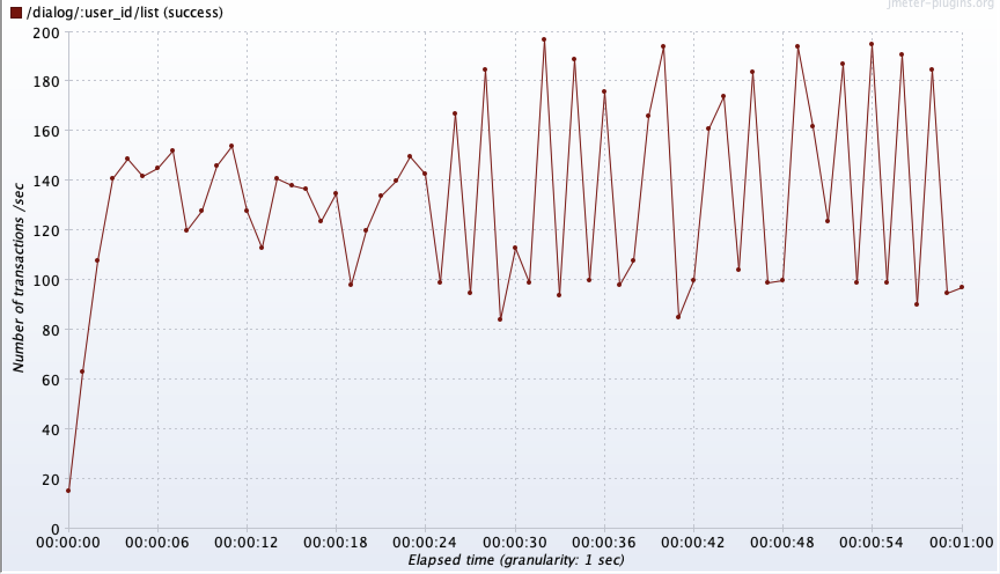 | 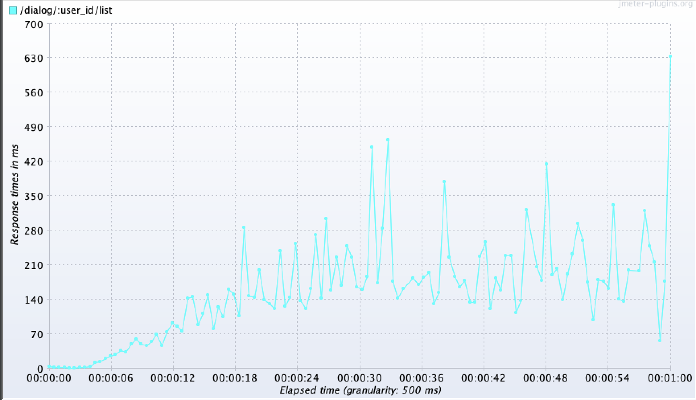 | 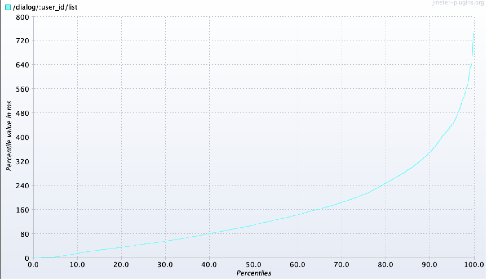 | 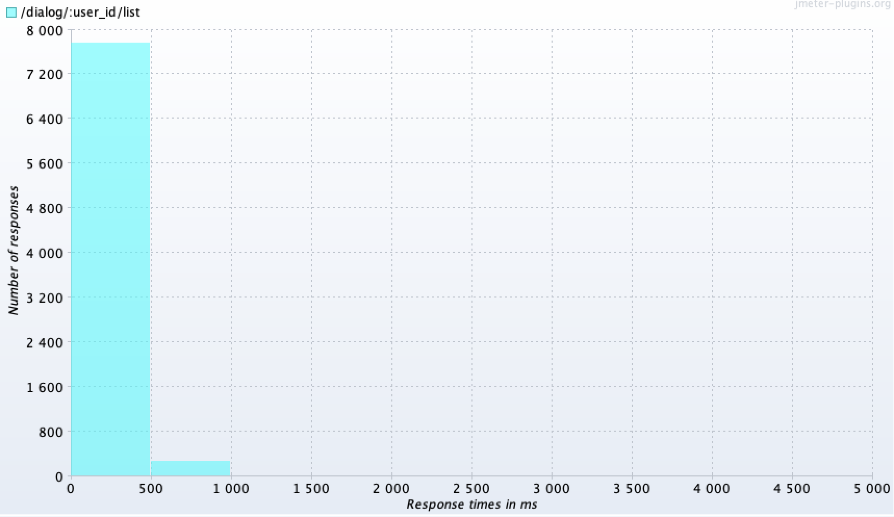 |
|-----------------------|-----------------------|-----------------------|-----------------------|

#### Графики для 1000 потоков (Tarantool)
| 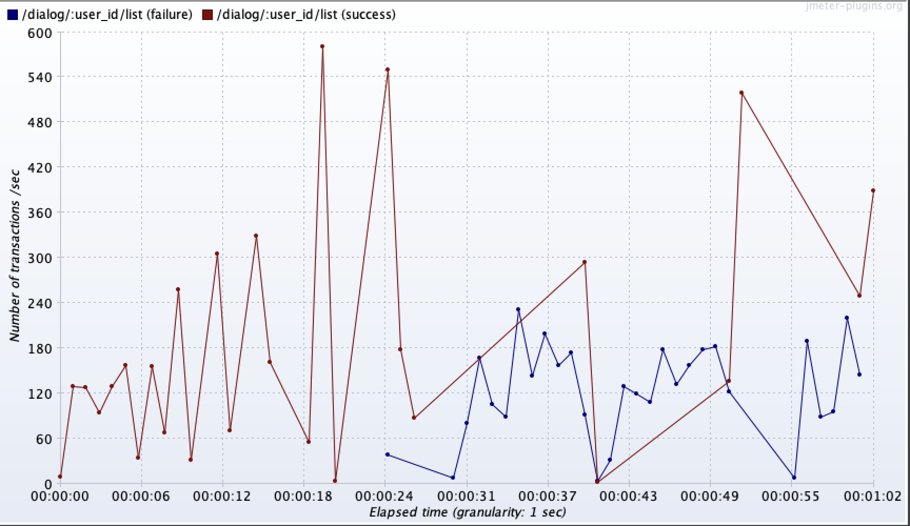 | 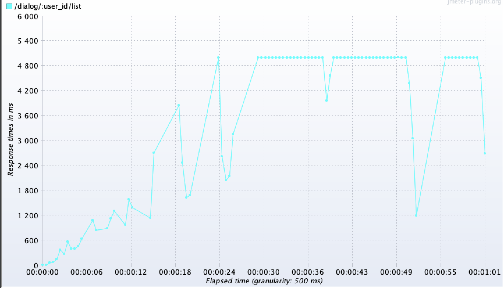 | 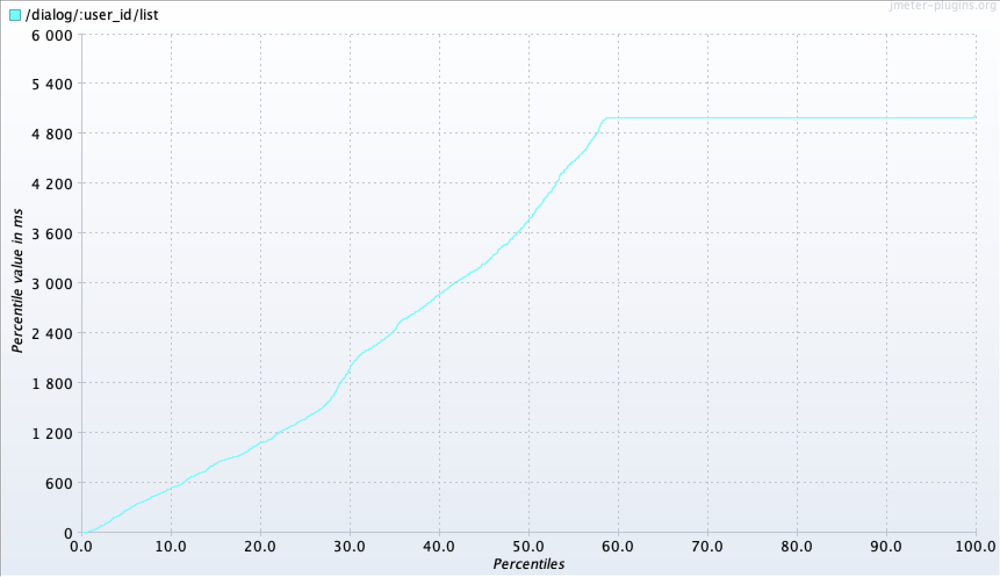 | 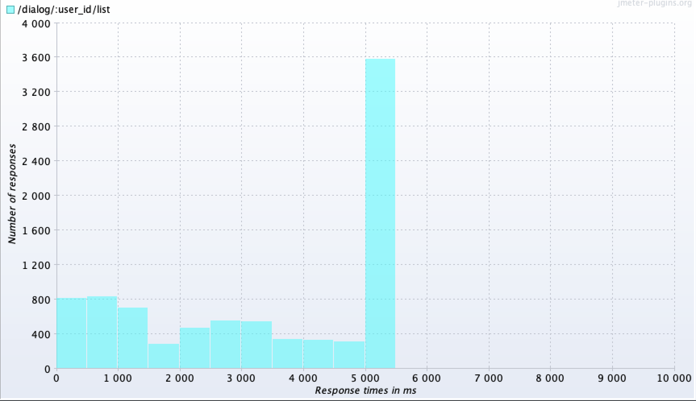 |
|-----------------------|-----------------------|-----------------------|-----------------------|

## Запуск приложения
В [Makefile](../Makefile):
- `make up-memory` - поднять окружение (БД Postgres master, tarantool, кеши, очередь), автоматически применить миграции, поднять сервис
- `make down-memory` - потушить окружение и сервис

