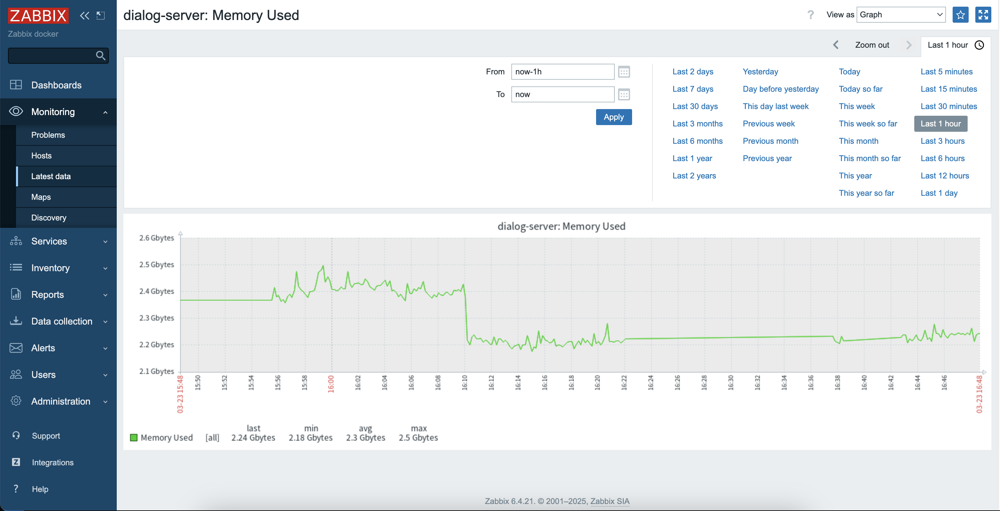

# Мониторинг

## Задание

Необходимо организовать мониторинг своего сервиса:
- развернуть zabbix;
- развернуть prometheus;
- развернуть grafana;
- начать писать в prometheus бизнес-метрики сервиса чатов по принципу RED;
- начать писать в zabbix технические метрики сервера с сервисом чатов;
- организовать дашборд в grafana

## Реализация

Все компоненты мониторинга развёрнуты в docker: [docker-compose-monitoring.yaml](../deployments/docker-compose-monitoring.yaml).  

В предыдущих ДЗ были развёрнуты и настроены prometheus, grafana, node-exporter, cadvisor для отслеживания нагрузки на контейнеры, а также эндпойнт `/metrics` для сбора стандартных метрик приложений.   

Дополнительно в сервисы `dialog-server` и `social-server` добавлены метрики по принципу RED [metrics.go](../backend/pkg/http/server/metrics.go):
- количество запросов
- количество ошибок (4xx и 5xx статусы, добавлено для наглядности, т.к. можно было бы использовать метрику с количеством запросом, отфильтрованную по необходимым статусам)
- время ответа.  

Также в сервисы `dialog-server` и `social-server` добавлена задача по периодическому сбору технических метрик по CPU и памяти и отправке их в zabbix [observer.go](../backend/pkg/zabbix/observer.go). Для каждого сервиса задан уникальный хост `zabbix`.   

Метрики собирает `prometheus`, все необходимые сервисы добавлены в его [конфиг](../deployments/monitoring/prometheus/prometheus.yml).  

В `grafana` настроены два дашборда, сохранены их шаблоны для автоматического импорта при старте:
- дашборд для отслеживания нагрузки на контейнеры (на основе `https://grafana.com/grafana/dashboards/893-main/`): [893_rev5.json](../deployments/monitoring/grafana/dashboards/imported/893_rev5.json)
- дашборд для мониторинга метрикс приложения по принципу RED (на основе `https://grafana.com/grafana/dashboards/19923-beyla-red-metrics/`): [backend-red.json](../deployments/monitoring/grafana/dashboards/red/backend-red.json)

Для `zabbix` подготовлены и импортированы шаблон технических метрик и хосты (на основе [observer.go](../backend/pkg/zabbix/observer.go) и заданных в конфигах названий хостов):
- [шаблон метрик](./zbx_template.yaml) 
- [хосты](./zbx_hosts.yaml)  

Для `zabbix` развёрнуты БД `zabbix-postgres`, сервер `zabbix-server` и UI `zabbix-web`. Агент `zabbix-agent` не разворачивался, т.к. отправка метрик организована через приложение.

Хосты в zabbix:

Метрики в шаблоне zabbix:

  
Собранные метрики в zabbix:

  
График метрики CPU User сервиса social-server в zabbix:

  
График метрики Memory Used сервиса dialog-server в zabbix:

Дашборд `grafana` для отслеживания нагрузки на контейнеры:

Дашборд `grafana` для отслеживания метрик RED:
  

## Запуск приложения
В [Makefile](../Makefile):
- `make up-memory` - поднять окружение (БД Postgres master, tarantool, кеши, очередь, мониторинги), автоматически применить миграции, поднять сервисы
- `make down-memory` - потушить окружение и сервисы
