# Репликация Postgres

## Мониторинги
Настроены мониторинги prometheus, grafana, node-exporter, cadvisor для отслеживания нагрузки на контейнеры.  
Соответствующий файл docker-compose - [docker-compose-monitoring.yaml](../deployments/docker-compose-monitoring.yaml)  
В графану импортирован дашборд `https://grafana.com/grafana/dashboards/893-main/` по id=893.

## Правки в коде
Для работы с пулами была использована библиотека `github.com/jackc/pgx/v5/pgxpool` (которая оказалась более эффективной). Максимальное количество соединений задано равным 80 (`maxConns` в [конфигах](../backend/social/configs/server_config.yaml)).    
В проект добавлен endpoint `/metrics` для сбора метрик приложения с помощью prometheus.

## Запуск приложения
В [Makefile](../Makefile):
- для приложения без реплик:
    - `make up-mon` - поднять окружение (БД Postgres master, мониторинги), автоматически применить миграции, поднять сервис
    - `make down-mon` - потушить окружение и сервис
- для приложения с репликами:
    - `make up-replicated` - поднять окружение (БД Postgres master и реплики, мониторинги), автоматически применить миграции, поднять сервис
    - `make down-replicated` - потушить окружение и сервис

## 1 мастер (без репликации)

### Запуск приложения
Запускаем всё приложение с 1 мастером через [Makefile](../Makefile) `make up-mon`.

### Нагрузочное тестирование на чтение (только master)
НТ проводилось с помощью JMeter. Использованы данные по пользователям из предыдущих ДЗ.   
План НТ - [replication_read_test.jmx](replication_read_test.jmx)  
Общее описание плана:
- в начале теста необходимо зарегистрировать нового пользователя и получить токен для последующего выполнения запроса `/user/search`. Поэтому для регистрации (`/user/register`) и получения токена (`/login`) использована `setUp` группа потоков с 1 потоком.
- само НТ методов `/user/search` и `/user/get/{userId}` выполняется в другой группе потоков с настраиваемым количеством потоков.  
В запросе `/user/get/{userId}` используется id пользователя, полученный на шаге `setUp`.  
В запросе `/user/search` используется токен, полученный на шаге `setUp`. Параметры метода `first_name` и `last_name` генерируются случайным образом и состоят из 3-х символов русского алфавита с первой заглавной буквой:
```
first_name=${__changeCase(${__RandomString(3,абвгдеёжзийклмнопрстуфхцчшщъыьэюя,firstName)},CAPITALIZE,)}
last_name=${__changeCase(${__RandomString(3,абвгдеёжзийклмнопрстуфхцчшщъыьэюя,lastName)},CAPITALIZE,)}
```
Количество потоков - 1000, скорость "разгона" - 10s, продолжительность - 60s, таймаут на соединение - 1s, таймаут на получение ответа - 5s.

### Результаты НТ на чтение (только master)
Первое НТ проводилось только с одной БД master.  
По сравнению с прошлым ДЗ видно, что с библиотекой `github.com/jackc/pgx/v5/pgxpool` производительность существенно увеличилась. 

| Route |   # Samples  |   Average  |   Median  |   90% Line  |   95% Line  |   99% Line  |   Min  |   Max  |   Error %  |   Throughput  |   Received KB/sec  |   Sent KB/sec  |
|---|---|---|---|---|---|---|---|---|---|---|---|---|
|   /user/search  |   297136  |   92  |   95  |   117  |   146  |   171  |   0  |   813  |   0.000%  |   4934.09276  |   598.78  |   2698.33  |
|   /user/get/{userId}  |   296588  |   91  |   95  |   116  |   141  |   168  |   0  |   648  |   0.000%  |   4925.81090  |   2188.71  |   2573.54  |

#### Графики НТ на чтение (только master)
| 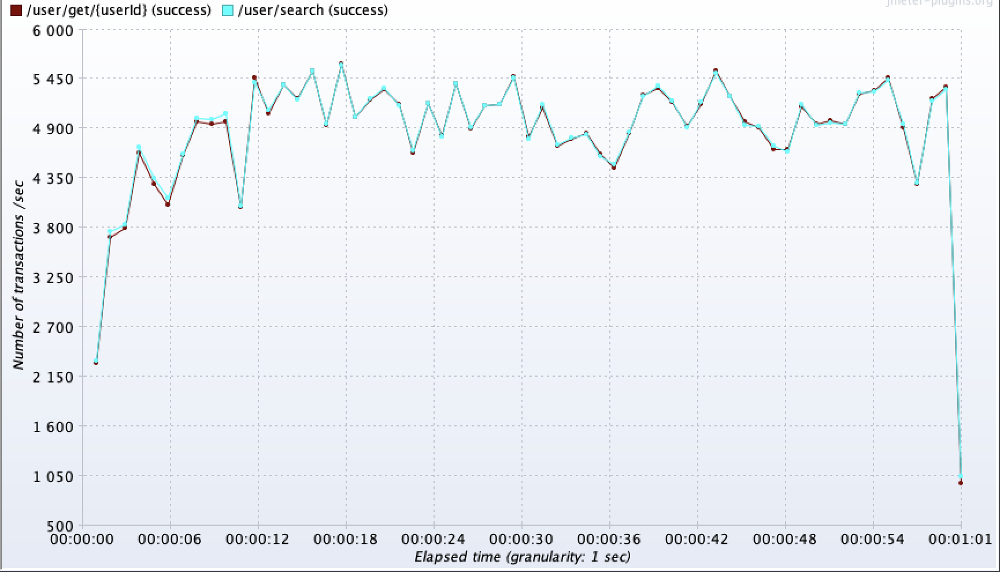 | 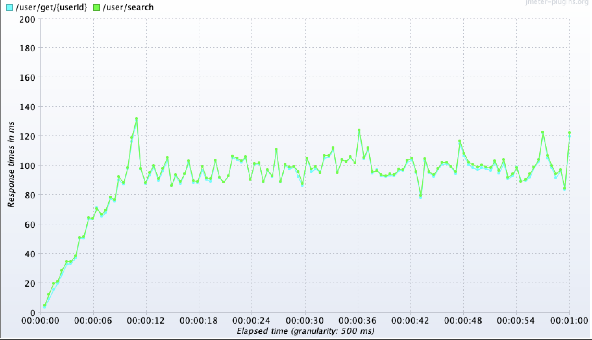 | 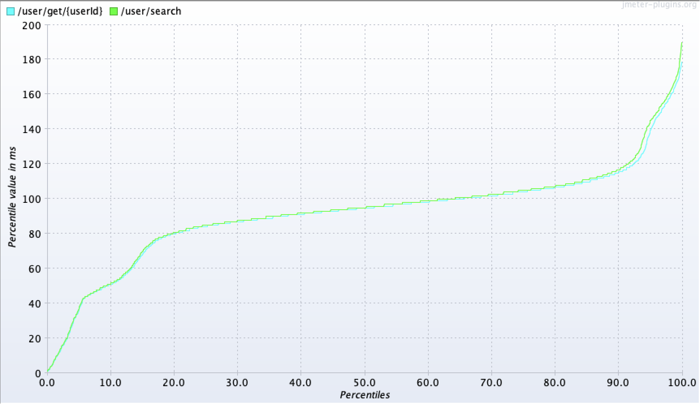 | 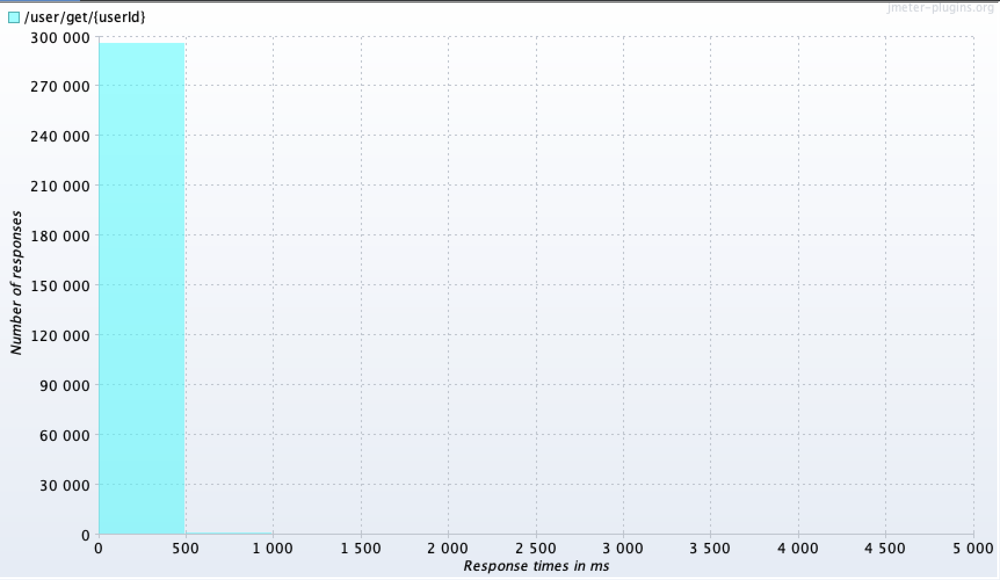 | 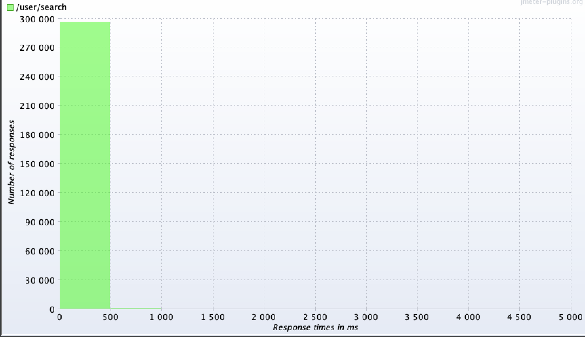 | 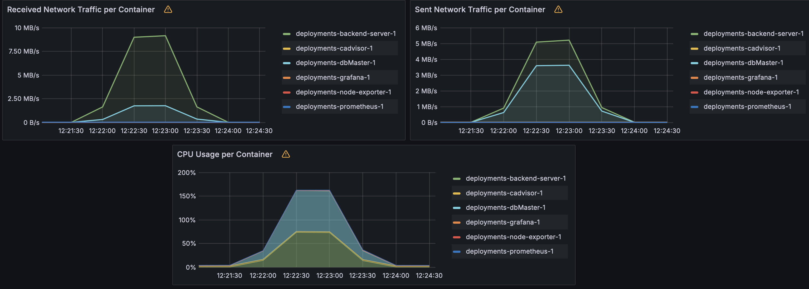 |
|-----------------------|-----------------------|-----------------------|-----------------------|-----------------------|-----------------------|

## Потоковая репликация с 1 мастером и 2 репликами

Поднимаем 3 инстанса БД Postgres - 1 мастер [docker-compose-db-master.yaml](../deployments/docker-compose-db-master.yaml) и 2 реплики [docker-compose-db-replicas.yaml](../deployments/docker-compose-db-replicas.yaml). Первоначальные настройки в docker-compose ничем не отличаются, параметры настроены впоследствии вручную.

### Настройка мастера
1) Поднимаем сначала только мастер:
    ```shell
    docker compose --env-file deployments/.env -f deployments/docker-compose-db-master.yaml up -d
    ```

2) Запоминаем `Subnet` сети (т.к. используем сеть по умолчанию, то будет аналогична сети bridge):
    ```shell
    docker network inspect deployments_default | grep Subnet
    docker network inspect bridge | grep Subnet
    ```

3) Меняем `postgresql.conf` на мастере:
    ```shell
    docker exec -it deployments-dbMaster-1 sh
    vi /var/lib/postgresql/data/pgdata/postgresql.conf
    exit
    ```

    ```conf
    ssl = off
    wal_level = replica
    max_wal_senders = 4 # expected slave num
    ```

4) Добавляем запись в `pg_hba.conf` с `subnet` с первого шага на мастере:
    ```shell
    docker exec -it deployments-dbMaster-1 sh
    vi /var/lib/postgresql/data/pgdata/pg_hba.conf
    exit
    ```

    ```conf
    # TYPE  DATABASE        USER            ADDRESS                 METHOD
    host    replication     replicator      172.19.0.0/16           md5
    ```

5) Создаём пользователя для репликации на мастере:
    ```shell
    docker exec -it deployments-dbMaster-1 sh
    psql -U otus -d backend
    backend=# CREATE ROLE replicator WITH REPLICATION LOGIN PASSWORD 'pass';
    exit
    ```

6) Перезапускаем мастер:
    ```shell
    docker compose --env-file deployments/.env -f deployments/docker-compose-db-master.yaml down
    docker compose --env-file deployments/.env -f deployments/docker-compose-db-master.yaml up -d
    ```

7) Создаём бэкап для реплик:
    ```shell
    docker exec -it deployments-dbMaster-1 sh
    mkdir /dbReplica1
    pg_basebackup -h dbMaster -D /dbReplica1 -U replicator -v -P --wal-method=stream
    exit
    ```

8) Копируем директорию к себе:
    ```shell
    docker cp deployments-dbMaster-1:/dbReplica1 dbReplica1/
    ```

### Настройка реплик

1) Создаём файл на основе бэкапа мастера, чтобы реплика узнала, что она реплика:
    ```shell
    touch dbReplica1/standby.signal
    ```

2) Меняем `postgresql.conf` на реплике `dbReplica1`:
    ```shell
    vi dbReplica1/postgresql.conf
    exit
    ```

    ```conf
    primary_conninfo = 'host=dbMaster port=5432 user=replicator password=pass application_name=dbReplica1'
    ```

3) Копируем директорию `dbReplica1` в `dbReplica2` и производим аналогичные правки с `standby.signal` и `postgresql.conf` для `dbReplica2`. Отличие будет только в `primary_conninfo`:
    ```shell
    vi dbReplica2/postgresql.conf
    exit
    ```

    ```conf
    primary_conninfo = 'host=dbMaster port=5432 user=replicator password=pass application_name=dbReplica2'
    ```

4) Подгружаем данные из локальных папок в вольюмы docker с помощью временных контейнеров:
    ```shell
    docker run --rm -v deployments_dbReplica1-backend-data:/data -v /MY_PATH/dbReplica1:/dbReplica1 alpine sh -c "cp -r /dbReplica1/* /data/"
    docker run --rm -v deployments_dbReplica2-backend-data:/data -v /MY_PATH/dbReplica2:/dbReplica2 alpine sh -c "cp -r /dbReplica2/* /data/"
    ```

5) Получившиеся вольюмы нужно монтировать к директории `/var/lib/postgresql/data/pgdata` реплик в [docker-compose-db-replicas.yaml](../deployments/docker-compose-db-replicas.yaml).

### Запуск приложения
Запускаем всё приложение с 1 мастером и 2 репликами через [Makefile](../Makefile) `make up-replicated`. Для реплик использован флаг `POSTGRES_INITDB_SKIP`, чтобы не была выполнена повторная инициализация.  
Проверяем на мастере. Результат - обе реплики работают в асинхронном режиме:  
```shell
docker exec -it deployments-dbMaster-1 sh
psql -U otus -d backend
backend=# select application_name, sync_state from pg_stat_replication;
application_name | sync_state
------------------+------------
dbReplica2       | async
dbReplica1       | async
(2 rows)
```

### Результаты НТ на чтение (2 реплики)
НТ [replication_read_test.jmx](replication_read_test.jmx) было проведено повторно, но с 2-мя репликами.
Видно, что пропускная способность увеличилась, а запросы на чтение распределяются равномерно между 2-мя репликами.

| Route |   # Samples  |   Average  |   Median  |   90% Line  |   95% Line  |   99% Line  |   Min  |   Max  |   Error %  |   Throughput  |   Received KB/sec  |   Sent KB/sec  |
|---|---|---|---|---|---|---|---|---|---|---|---|---|
|   /user/search  |   512282  |   53  |   51  |   96  |   107  |   133  |   0  |   418  |   0.000%  |   8494.85117  |   1029.25  |   4645.62  |
|   /user/get/{userId}  |   511794  |   53  |   50  |   95  |   106  |   132  |   0  |   365  |   0.000%  |   8488.16651  |   3771.60  |   4434.74  |

#### Графики НТ на чтение (2 реплики)
| 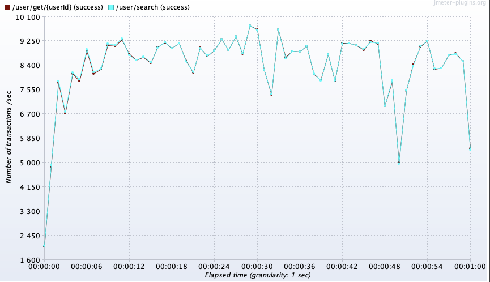 | 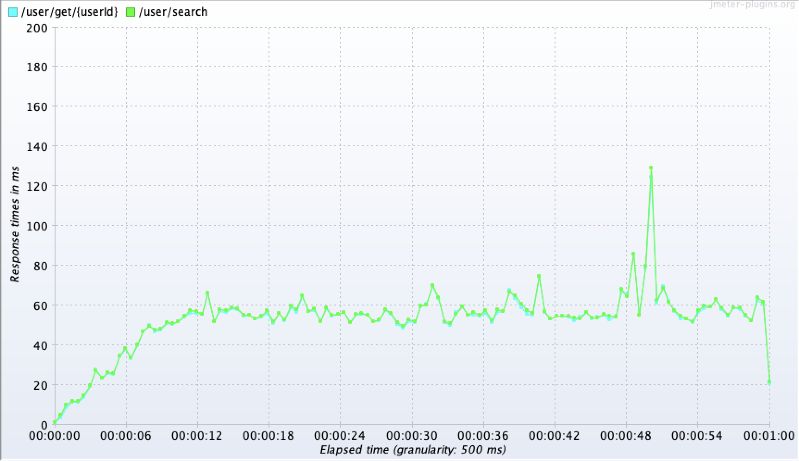 | 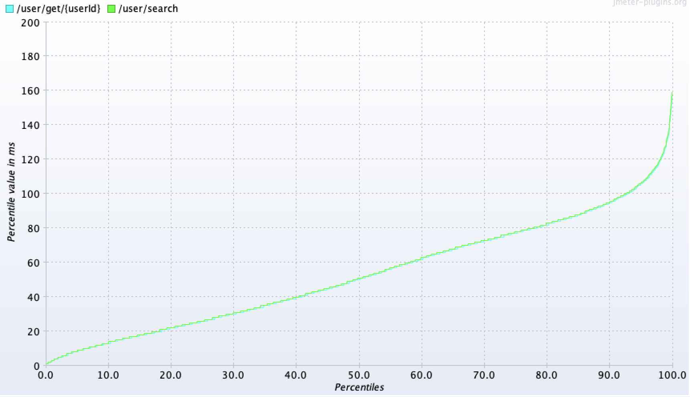 | 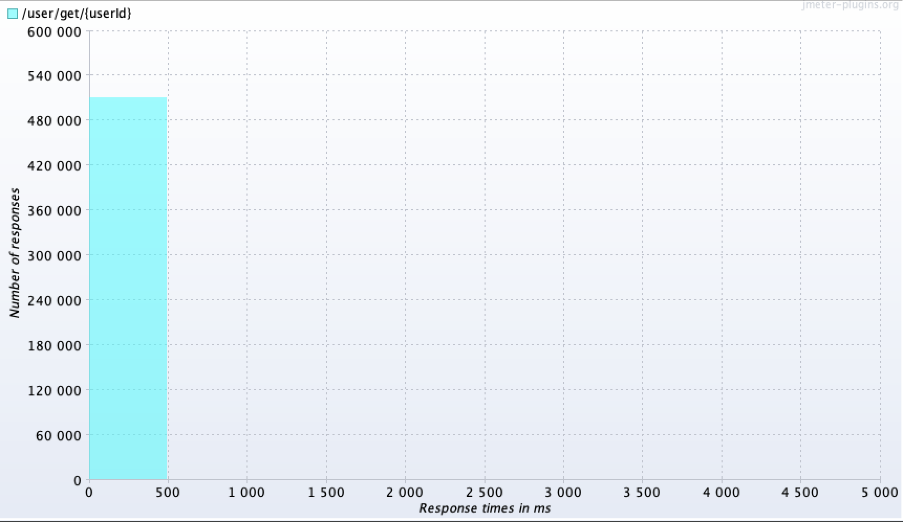 | 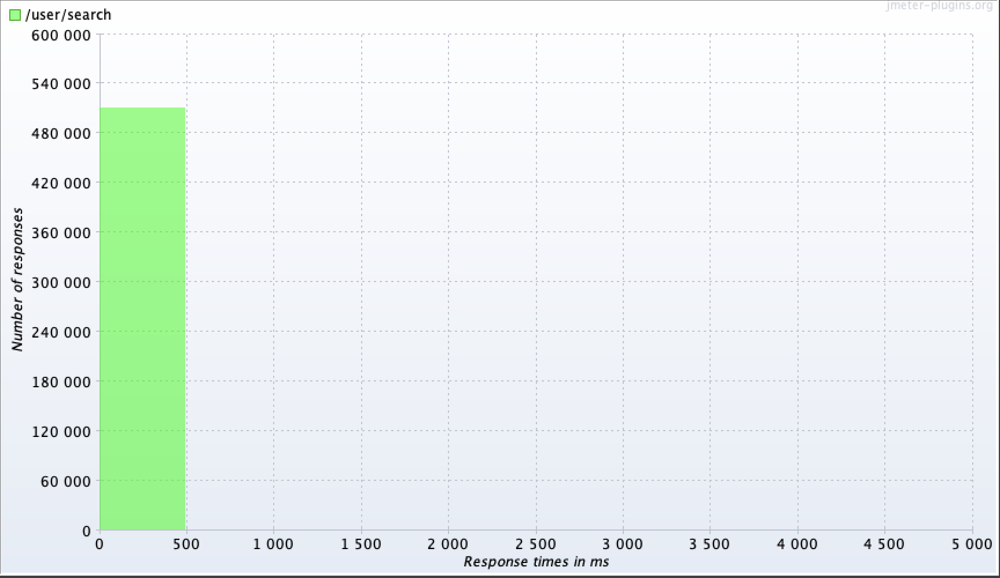 | 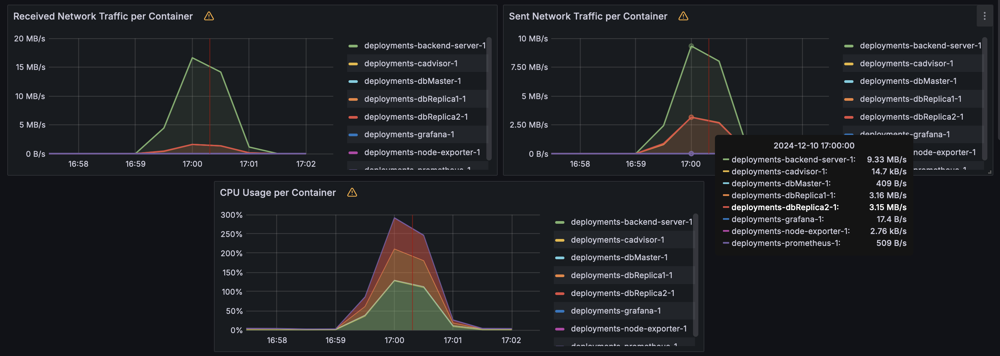 |
|-----------------------|-----------------------|-----------------------|-----------------------|-----------------------|-----------------------|

## Кворумная синхронная репликация с 1 мастером и 2 репликами
Как и ранее, приложение запущено с 1 мастером и 2 репликами через [Makefile](../Makefile) `make up-replicated`.

### Настройка 
1) Включаем синхронную репликацию на мастере:
    ```shell
    docker exec -it deployments-dbMaster-1 sh
    vi /var/lib/postgresql/data/pgdata/postgresql.conf
    exit
    ```

    ```conf
    synchronous_commit = on
    synchronous_standby_names = 'FIRST 1 (dbReplica1, dbReplica2)'
    ```

2) Перечитываем конфиг на мастере:
    ```shell
    docker exec -it deployments-dbMaster-1 sh
    psql -U otus -d backend
    backend=# select pg_reload_conf();
    exit
    ```

3) Проверяем на мастере. Результат - обе реплики работают в синхронном режиме:  
    ```shell
    docker exec -it deployments-dbMaster-1 sh
    psql -U otus -d backend
    backend=# select application_name, sync_state from pg_stat_replication;
    application_name | sync_state
    ------------------+------------
    dbReplica2       | potential
    dbReplica1       | sync
    (2 rows)
    ```

### Нагрузочное тестирование на запись (отключение реплики)
НТ проводилось с помощью JMeter. 
План НТ - [replication_write_test.jmx](replication_write_test.jmx)  
Выполнено НТ метода регистрации нового пользователя `/user/register` в группе потоков с настраиваемым количеством потоков.  
Количество потоков - 100, скорость "разгона" - 10s, продолжительность - 60s, таймаут на соединение - 1s, таймаут на получение ответа - 5s.  
В процессе НТ (на 30 секунде) была убита реплика `dbReplica1` через `docker stop deployments-dbReplica1-1`

### Результаты НТ на запись (отключение реплики)
| Route |   # Samples  |   Average  |   Median  |   90% Line  |   95% Line  |   99% Line  |   Min  |   Max  |   Error %  |   Throughput  |   Received KB/sec  |   Sent KB/sec  |
|---|---|---|---|---|---|---|---|---|---|---|---|---|
|   /user/register  |   3688  |   1506  |   1558  |   1969  |   2082  |   2389  |   64  |   4115  |   0.000%  |   60.66987  |   10.25  |   33.89  |

#### Графики НТ на запись (отключение реплики)
| 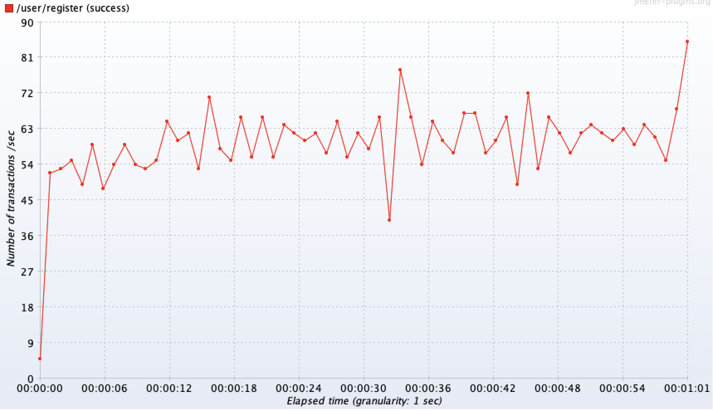 | 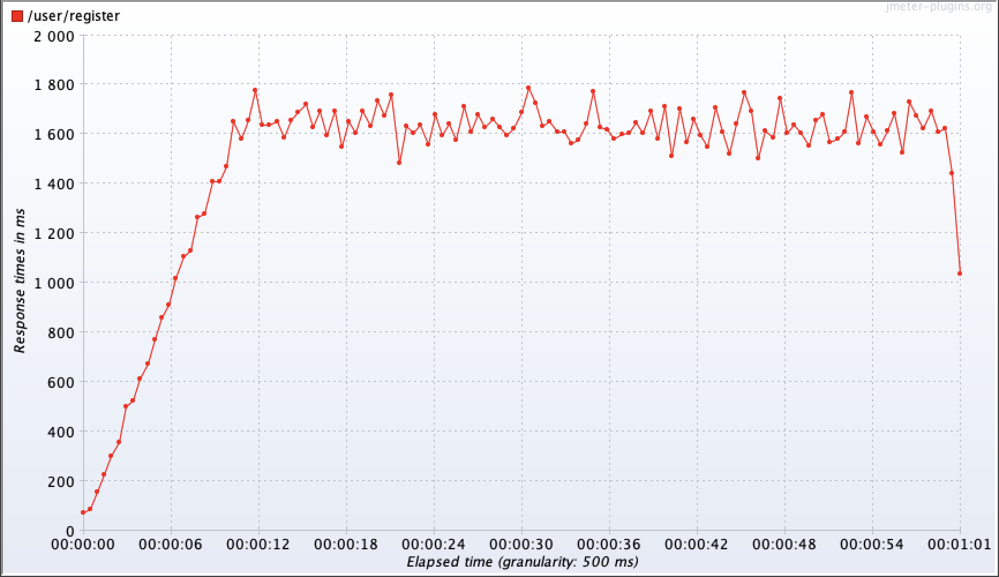 | 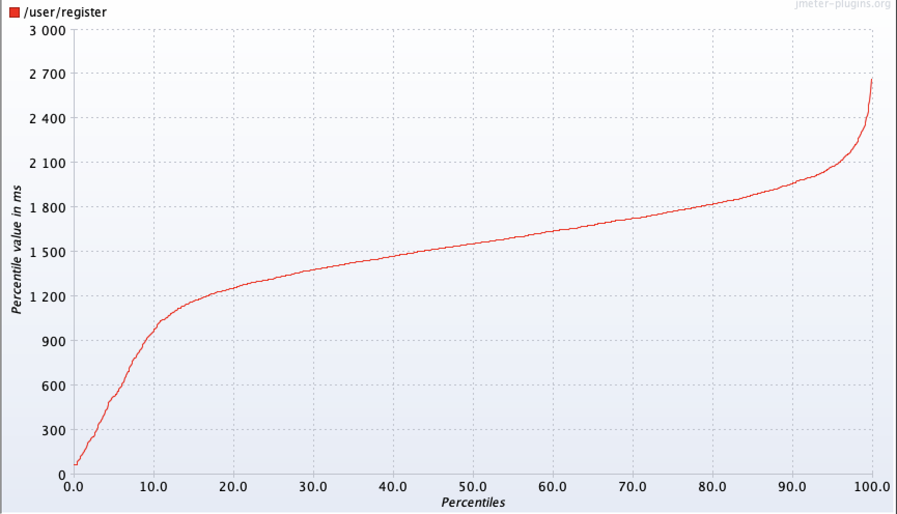 | 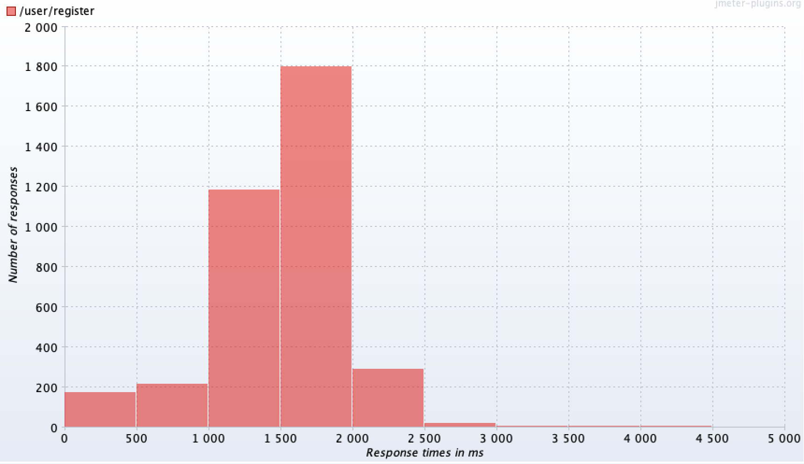 | 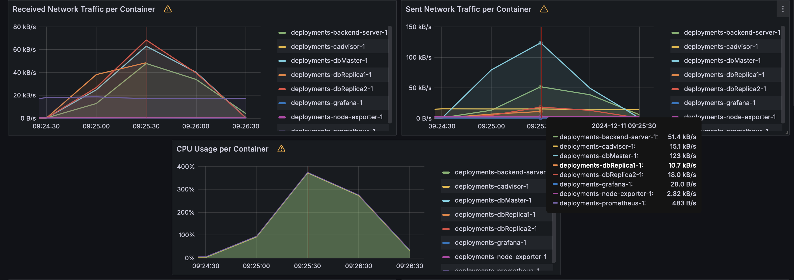 |
|-----------------------|-----------------------|-----------------------|-----------------------|-----------------------|

По графику с нагрузкой на контейнеры видно, что в середине НТ нагрузка на 1-ую реплику прекратилась.

### Восстановление реплики
1) До НТ было определено количество строк в таблице `users` (на мастере и репликах совпадало и было равно `1000196`):
    ```shell
    docker exec -it deployments-dbMaster-1 sh
    psql -U otus -d backend
    backend=# select count(*) from users;
    count
    --------
    1000196
    (1 row)
    ```

2) После того, как реплика `dbReplica1` была убита, статус репликации следующий (только одна синхронная реплика):
    ```shell
    docker exec -it deployments-dbMaster-1 sh
    psql -U otus -d backend
    backend=# select application_name, sync_state from pg_stat_replication;
    application_name | sync_state
    ------------------+------------
    dbReplica2       | sync
    (1 row)
    ```

3) После НТ количество строк на мастере и одной реплике равно `1003884`:
    ```shell
    backend=# select count(*) from users;
    count
    ---------
    1003884
    (1 row)
    ```

4) Выполнено повышение реплики `dbReplica2` до мастера:
    ```shell
    docker exec -it deployments-dbReplica2-1 psql -U otus -d backend
    backend=# select pg_promote();
    exit;
    ```

5) Отключен мастер:
    ```shell
    docker stop deployments-dbMaster-1
    ```

6) Снова включена реплика `dbReplica1`, посчитано количество строк на ней:
    ```shell
    docker start deployments-dbReplica1-1

    docker exec -it deployments-dbReplica1-1 sh
    psql -U otus -d backend
    backend=# select count(*) from users;
    count
    ---------
    1001988
    (1 row)

7) В конфигурацию реплики `dbReplica1` внесены правки для переключения на `dbReplica2` в качестве мастера, выполнена перезагрузка конфига:
    ```shell
    docker exec -it deployments-dbReplica1-1 sh
    vi /var/lib/postgresql/data/pgdata/postgresql.conf
    psql -U otus -d backend
    backend=# select pg_reload_conf();
    ```

    ```conf
    primary_conninfo = 'host=dbReplica2 port=5432 user=replicator password=pass application_name=dbReplica1'
    ```

8) Состояние репликации после выполненных действий:
    ```shell
    backend=# select application_name, sync_state from pg_stat_replication;
    application_name | sync_state
    ------------------+------------
    dbReplica1       | async
    (1 row)
    ```

9) Количество строк в таблице на реплике `dbReplica1` восстановилось:
    ```shell
    backend=# select count(*) from users;
    count
    ---------
    1003884
    (1 row)
    ```

